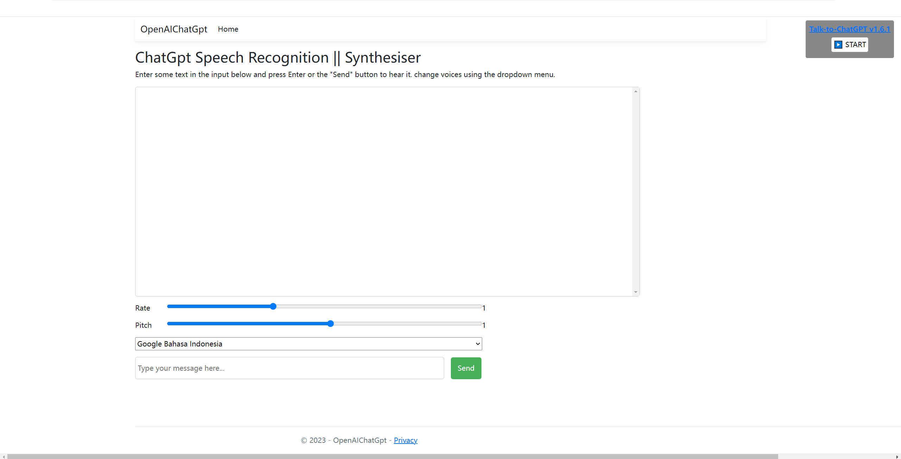
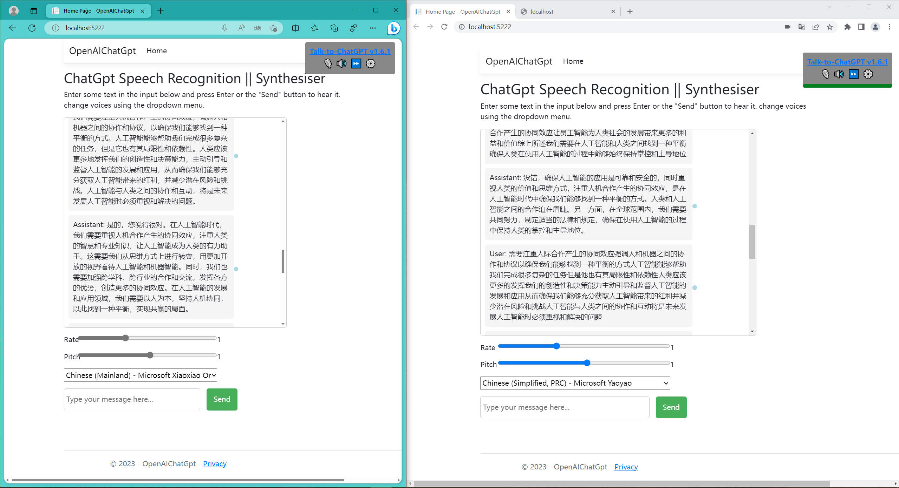

<h1 align="center">
  ChatGpt AI Assistant Learner
</h1>

  为语言学习者设计的口语对话web，后端基于asp.net core 6.0，接口采用OpenAi公司提供的最新ChatGpt3.5 Turbo Api

  界面虽简，不乏为你的生活学习解闷好帮手 (●ˇ∀ˇ●)

    
  

 

## ✨ 设计思想

自从ChatGpt一问世，就想做一个这样的工具，ChatGpt足够强大💪，如果加上语音对话加持，简直Perfect！无论是做语音助手，还是语言等各种学习，都非常合适。
ChatGpt3.5 Turbo Api 已经开放，可惜不像之前的接口无需科学上网即可访问，我这个工具的限制就这里，
调用组件为Betalgo.OpenAI.GPT3，前端语音识别，语音合成想法来源于无意间看到MDN官网的 Window.speechSynthesis，并有示例界面参考 👍
后又看到github有作者开源了一个talk-to-chatgpt网页扩展，非常好用的，大家可以去试试,
于是就把他们集成了。支持的语音看浏览器而定，edge最多，谷歌，火狐也都完善。
支持语音识别，也可以手动输入，还有回放功能。

 
 

#### 🎈 Tips

需要有自己Api-key 

 

## 🎙 功能与建议

目前项目处于开发初期，可能还有BUG，如果你对软件有任何功能与建议，欢迎在 Issues 中提出
如果你也喜欢本软件的设计思想，欢迎提交 pr，非常感谢你对我的支持！
 
 

## 🏄‍♂️ 贡献指南

如果您对本项目感兴趣，我非常欢迎参与到项目的贡献中，我会尽可能地提供帮助
再次感谢您对项目的贡献！🎉

 

## 🎁 大感谢

### 灵感来源 &&开源项目

[OpenAi](https://github.com/betalgo/openai)
Dotnet SDK for OpenAI Chat GPT、GPT-3 和 DALL·E 非官方。GPT-3 没有任何官方的 .Net SDK。
非常感谢作者以做快的速度推出了最新的接口。

[MDN](https://developer.mozilla.org/en-US/docs/Web/API/Window/speechSynthesis)  
MDN Web Docs是一个开源的协作项目，记录了Web平台技术，包括CSS，HTML，JavaScript和Web API。我们还为初学者和学生提供了一套广泛的学习资源。

[Talk-to-ChatGPT](https://github.com/C-Nedelcu/talk-to-chatgpt)    
Talk-to-ChatGPT是一个非常优秀的Google Chrome扩展程序，允许用户使用语音（语音识别）与ChatGPT AI交谈，并用语音（文本到语音）收听机器人的回答，而不仅仅是通过打字。使用此工具，用户可以与AI交谈并接收语音响应，使交互感觉更加自然和对话。这在各种环境中都很有用，在这些环境中，与AI进行更像人类的交互会很有帮助。

 

也感谢 [qwerty-learner](https://github.com/Kaiyiwing/qwerty-learner) ,提供了本文的参考。

### Respect!
